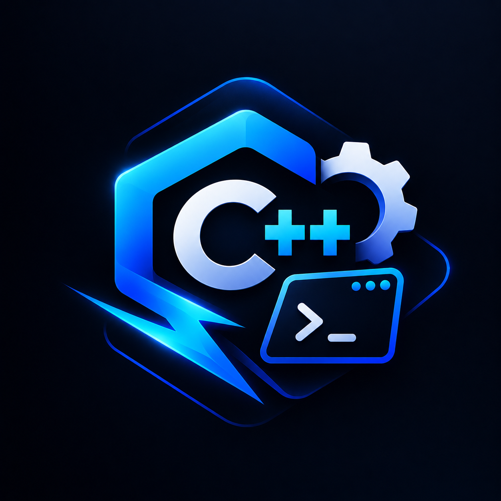

# Setify C++

### Zero-configuration C++ tooling for Visual Studio Code

**Install one extension. Write `.cpp`. Press Run. That's the entire setup process.**

[**Install from Marketplace**](https://marketplace.visualstudio.com/items?itemName=Syntrojex.setify-cpp) &nbsp;·&nbsp; [Repository](https://github.com/Syntrojex/setify-cpp-vscode) &nbsp;·&nbsp; [Report an Issue](https://github.com/Syntrojex/setify-cpp-vscode/issues) &nbsp;·&nbsp; [Changelog](#-release-notes)

---

## Table of Contents

- [The Problem](#the-problem)
- [The Solution](#the-solution)
- [Features](#-features)
- [Platform Support](#️-platform-support)
- [Installation](#-installation)
- [How It Works, Technically](#-how-it-works-technically)
- [Requirements](#-requirements)
- [Commands](#️-commands)
- [Frequently Asked Questions](#-frequently-asked-questions)
- [Privacy & Safety](#-privacy--safety)
- [Release Notes](#-release-notes)
- [Credits](#credits)
- [License](#license)

---

## The Problem

Every C++ beginner on Windows hits the same wall before writing a single meaningful line of code:

- Which MinGW build do I even download — MinGW, MinGW-w64, TDM-GCC, MSYS2, WinLibs?
- Where do I extract it?
- How do I add it to PATH without breaking something else?
- Why does VS Code's Run button keep asking me to "select a compiler"?
- Why does IntelliSense show red squiggles under `#include <iostream>` even after installing everything?

None of this has anything to do with learning C++. It's tooling friction, and it stops people before they start.

---

## Credits

Designed and built by **Muhammad Mustafa Amir**

---

## License

Released under the [MIT License](LICENSE) — free to use, modify, and distribute.

---

If Setify C++ saved you the trouble of manually configuring MinGW, consider ⭐ starring [the repository](https://github.com/Syntrojex/set-cpp-vscode).

